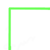
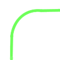
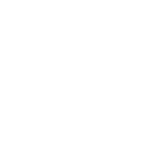

# Negative Priming Shapes
## Synopsis
This tool generates a virtually unlimited number of visual stimuli based on the [DeSchepper & Treisman Implicit Coding](https://psycnet.apa.org/doi/10.1037/0278-7393.22.1.27) paradigm, allowing for exploration of implicit memory and negative priming. The generator was primarily developed to supplement [ROAR-Shape](https://roar.stanford.edu/), a shape-matching task created for the [Yeatman Lab](https://jacobsfoundation.org/fellows/jacobs-foundation-research-fellowship-en/jason-yeatman/) aimed at diagnosing and screening for dyslexia. 

However, this generator is not limited to just that. It can be used for any cognitive experiments involving visual stimuli. The components for the stimuli can be generated via AI (for this project, [OpenAI's DALL-E 2 model](https://openai.com/dall-e-2) was leveraged), and the Python or JavaScript programs provided can stitch together the parts.

## Motivation
ROAR-Shape serves as an exploratory intersection of cognitive psychology and artificial intelligence, investigating the manifestation of 'negative priming' with novel, meaningless visual stimuli. Leveraging AI's capacity to generate infinite unique shapes, this tool probes the existence and extent of implicit memory and response inhibition processes in the absence of pre-existing object representations. It presents a novel framework for understanding the involuntary cognitive underpinnings of attention, memory, and perceptual interference.

## Table of Contents
- [Installation](#installation)
- [Demo](#demo)
- [Usage](#usage)
- [Appendix](#appendix)

## Installation

Before you start, ensure you have met **one** of the following requirements:
* You have a **Windows/Linux/Mac** machine running the latest version of **Python**.
* You have a **Javascript** environment setup with **Node.js** installed.

To install the Python variant, follow these steps:
```shell
git clone https://github.com/<your_username>/negativeprimingshapes.git
cd negativeprimingshapes
pip install -r requirements.txt
```

To use the JavaScript implementation, install the required packages using npm:
```shell
npm install sharp
npm install shuffle-array
```

## Demo
Sample inputs:  






Sample outputs:  




Even with relatively simple inputs, the output can be quite complex! The number of possible stimuli can grow exponentially.

**Note:** The new variant of this code allows for explicit RGB/hexadecimal colors to be encoded. By default the three colors specified by DeSchepper & Treisman are used to recolor the outputs and generate three sets of stimuli.

## Usage
To use negativeprimingshapes, simply place the component images in the correct folder and run the main Python function:
```shell
python main.py
```

You can also navigate to the relevant folder and run the JavaScript code:
```shell
generate_shapes.js
```

## Appendix
### Cognitive Theory
The motivation behind this project, ROAR-SHAPE, lies at the convergence of cognitive psychology and artificial intelligence, drawing specifically upon the theoretical foundations of attention, memory, and response interference. The crux of our exploration lies in the phenomenon known as "negative priming," a cognitive process indicative of an implicit memory system operating beyond our conscious control.
### Negative Priming
Negative priming is a cognitive mechanism wherein an irrelevant stimulus on one trial becomes a pertinent stimulus on a subsequent trial, leading to slower response times compared to a control stimulus that wasn't previously introduced. This phenomenon is thought to be due to inhibitory processes that suppress irrelevant stimuli to prevent response competition. Thus, negative priming serves as a robust indirect measure of implicit memory, particularly advantageous over positive priming since it reflects involuntary processing and is relatively uncontaminated by any conscious use of supposedly implicit material.
### Research Question
The primary hypothesis driving this project revolves around the question - "Would negative priming still be found if the stimuli are unfamiliar meaningless shapes?" This probes the formation of new object tokens, which is distinct from the reactivation of existing types. By generating infinite unique shapes via an artificial intelligence algorithm, we seek to understand if implicit representations can be formed even for novel, meaningless shapes.

This inquiry emerges from a juxtaposition of two fundamental perspectives in cognitive psychology. On one hand, we have studies like those conducted by Rock and Gutman (1981), where it was demonstrated that recognition for unattended, novel shapes was at chance, leading to the proposition that attention is needed to form representations of shape. On the other hand, a rich body of research indicates that implicit memory can be revealed through indirect measures, independent of any explicit recognition.
### Stimuli Generator and ROAR-SHAPE
Our project, the ROAR-SHAPE, stands on the premise that implicit memory can indeed exist for novel stimuli, even if no conscious memory persists. The generator is designed to produce visual stimuli for experimental paradigms that study implicit memory and negative priming with novel, meaningless shapes. The generated stimuli are then applied in a same-different judgment task, similar to the experimental setup used by Rock and Gutman, but with a critical distinction—here, we focus on how unattended shapes from a previous trial affect the response times when they become attended in a subsequent trial.

In essence, ROAR-SHAPE endeavors to bridge the gap between AI and cognitive psychology, generating insights about the intricate interplay between attention, implicit memory, and perception, and providing a novel toolset for the exploration of these fundamental cognitive processes.
